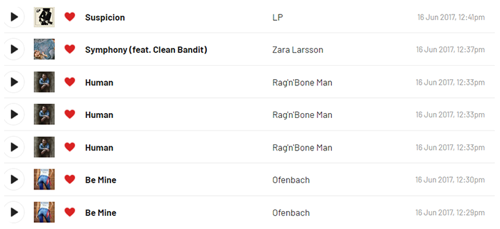

# lastfm-tracks-dumper


The application obtains listened (aka *scrobbled*) tracks for a specific [Last.fm](https://www.last.fm/home) user 
and save it to a **.csv** file. The application allows to download all scrobbled tracks or duplicated as well.

### Usage

Run the application **.jar** file and provide next parameters:
- required username (`--user`)
- API token, see [here](https://www.last.fm/api#getting-started) (`--token`)
- download strategy (`--starategy`, optional):
    * `default` - get all scrobbled tracks
    * `only-duplicates` - get duplicated tracks without the 1st one (can be used for deduplication of the library)
    * `without-duplicates` - get only duplicated tracks (each duplicated track of the scrobbling history will be shown once)

```shell
java -jar lastfm-tracks-dumper.jar --user %user% --token %token% --strategy default
```

### Duplicates

Due to scrobbling issues duplicated tracks can appear in the library 2 or more times. The application determine 
duplicates with two rules:
1. Duplicated tracks go in **sequential order**.
2. Difference in the scrobbled time is **less than 5 sec**.



Depending on the strategy there will be different output result:
* `only-duplicates` -  track **Human** will appear 2 times, track **Be Mine** 1 time.
* `without-duplicates` - each duplicated track will appear just once.

### Exported .csv data

Generated .csv has tab as separator as some names can contain `;` symbol in it.

Currently only `date`, `artist`, `track` and `album` values are saved to .csv.

Additional fields `page`, `pageLink` and `index` were added for easy navigation in the library.

ID's for **track/artist/album** are not saved due to this [Last.fm issue](
https://support.last.fm/t/invalid-mbids-in-responses-to-user-gettoptracks-and-user-getrecenttracks/2011).

